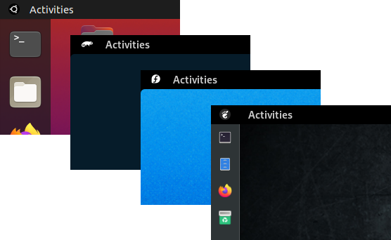

# OS Menu

A useless but fancy GNOME Shell extension showing a logo in the system status bar.



 When clicked the system "About" page will be opened.


## Building and Installing

To clone the repository execute:
```shell
$ git clone https://github.com/rovellipaolo/gnome-shell-extension-osmenu
$ cd gnome-shell-extension-osmenu
```

To build the extension execute:
```shell
$ make build
```
**NOTE:** This will create a zip archive named `osmenu@rovellipaolo-gmail.com.shell-extension.zip`.

To install the extension execute:
```shell
$ make install
```
**NOTE:** This will unzip the previously builded zip archive into `~/.local/share/gnome-shell/extensions/osmenu@rovellipaolo-gmail.com`.

Afterwards, restart GNOME Shell: press `Alt`+`F2`, type `r` and press enter.

Finally, if not already done, enable the extension at: [https://extensions.gnome.org](https://extensions.gnome.org/local)
Or, alternatively, to enable the extension execute:
```shell
$ make enable
```
While to disable the extension execute:
```shell
$ make disable
```


## Configuring

To customize and change the menu icon, just replace the `icon.svg` file with the one of your choice.

The included icon was created by _Aha-Soft_ and published under the _Creative Commons (Attribution 3.0 Unported)_ terms: https://www.iconfinder.com/icons/401276/gnome_icon

There you can find also distro-specific icons, such as:
* CentOS: https://www.iconfinder.com/icons/401265/centos_icon
* Debian: https://www.iconfinder.com/icons/401270/debian_icon
* Fedora: https://www.iconfinder.com/icons/401271/fedora_icon
* openSUSE: https://www.iconfinder.com/icons/401303/opensuse_icon
* Red Hat: https://www.iconfinder.com/icons/401312/redhat_icon
* Ubuntu: https://www.iconfinder.com/icons/401323/ubuntu_icon


## Running Checkstyle

To run the checkstyle execute:
```shell
$ make checkstyle
```
**NOTE:** This is using [`eslint`](https://github.com/eslint/eslint) under-the-hood.


## Debugging

To show GNOME Shell logs execute:
```shell
$ make show-logs
```
